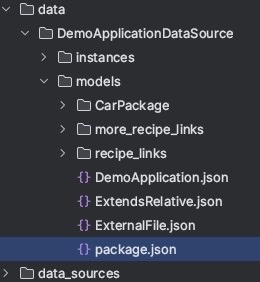

Documents can have an attribute called `_meta_`. 


```json
{
  "_meta_": {
    "type": "CORE:Meta",
    "version": "0.0.1",
    "dependencies": [
      {
        "alias": "CORE",
        "address": "system/SIMOS",
        "version": "0.0.1",
        "protocol": "dmss"
      }
    ]
  }
}
```


The `_meta_` information makes it possible to use alias as a reference to other documents like Blueprints or Packages.
In DMSS, a dependency `ALIAS:` is translated to:  `<protocol>://<address>/`.
In the example above, there is a dependency with alias `CORE:Package` that will be translated to the reference `dmss://system/SIMOS/Package` in DMSS.

When using [dm-cli](https://github.com/equinor/dm-cli) to upload documents to DMSS, the alias is automatically translated to the reference. Therefore, all documents stored in DMSS have the full reference on the format `<protocol>://<dataSource>/<path>` instead of the alias `<alias>:<path>`.  

When exporting documents from DMSS using the endpoint `export/{absolute_document_ref}`, the references are translated back to the alias format `<alias>:<path>`. 

DMSS can also be used to find the `_meta_` information of an entity, using the `export/meta`endpoint.

# How to define Meta info for a package
When modeling locally (creating local json files) a special `package.json` can be used to define meta information for a package.

Example: 



The `package.json` should be placed inside a local folder. In the example above, the package `models` will have the meta information defined in the `package.json` file.

Example package.json file:
```json title="package.json"
{
  "name": "models",
  "type": "CORE:Package",
  "_meta_": {
    "type": "CORE:Meta",
    "version": "0.0.1",
    "dependencies": [
      {
        "type": "CORE:Dependency",
        "alias": "CORE",
        "address": "system/SIMOS",
        "version": "0.0.1",
        "protocol": "dmss"
      }
    ]
  }
}

```

Note: the alias defined in the `package.json` will also be available for use in all sub packages and sub documents of the `models` package in the example above. 