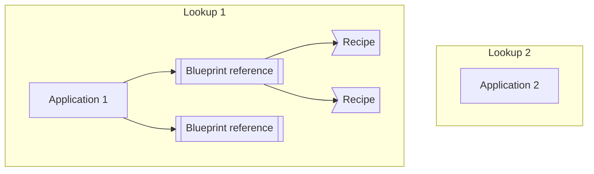

To express how a model is _stored_ and how it is _presented_, we use a concept of StorageRecipes and UiRecipes.

A recipe is an instance of the core Storage-/UiRecipe blueprints.

## StorageRecipe

A recipe for how to store the data for an entity based on the given blueprint type.

StorageRecipes are mainly to be consumed by the Data Modelling Storage Service.  

For now, StorageRecipes are mainly used to split large models into smaller parts. Either because it makes sense logically, or for performance reasons.

A StorageRecipes may look something like this;

```json
{
  "type": "dmss://system/SIMOS/StorageRecipe",
  "name": "DEFAULT",
  "description": "",
  "attributes": [
    {
      "name": "content",
      "type": "object",
      "contained": false
    }
  ]
}
```

This StorageRecipes is used for the core `dmss://system/SIMOS/Package`-type. Here we can see that any objects that are a 
part of the "content" attribute for a package, is not contained in that package entity but is only referred to. Which makes sense logically.  Instead of the actual object, a reference object is added, and it includes the name, type, and _id of the object referenced. 

## UiRecipe

A recipe for how to present data.

UiRecipes follow many of the same patterns as StorageRecipes, but are used when any client is to present an entity to a user. Like in a web application. 

A UiRecipe may look something like this;
```json
{
  "type": "dmss://system/SIMOS/UiRecipe",
  "name": "Edit",
  "description": "Default blueprint edit",
  "plugin": "edit-blueprint",
  "category": "edit",
  "config": {
    "type": "dmss://system/SIMOS/PluginsConfig/EditBlueprint",
    "fontColor": "blue"
  }
}
```
This example is a UiRecipe used for entities of the core `dmss://system/SIMOS/Blueprint`-type.  
This particular recipe is used to load a javascript UI-plugin named "edit-blueprint".
The "config" value of a UiRecipe is of type "object", and can be any valid blueprint. The object itself is passed to the plugin, and it's up to the plugin to interpret the config object.


## RecipeLinks, RecipeLookups and ApplicationContexts

Since different applications may have different needs for viewing the same model, UiRecipes can only be associated with a 
specific blueprint by creating an __application recipe lookup__.



This diagram shows the relationship between a named _lookup_, a list of blueprint references, and recipes for each blueprint.
The lookup object itself "lives" in an DMSS instance, and can be created by either basic API-calls, or using the [DM-CLI](https://github.com/equinor/dm-cli) tool.

Input for the "create application lookup" is a _name_ (the application name should be used), and a path to a (sub)package
that has been uploaded to DMSS.

```bash
dm create-lookup myApp MyDataSource/instances/recipe_links
```

This will create a lookup with name `myApp` in DMSS, based on all the entities of `dmss://system/SIMOS/RecipeLink` found within the `MyDataSource/instances/recipe_links`-package.

For reference, _RecipeLinks_ may look like this;

```json
{
  "type": "dmss://system/SIMOS/RecipeLink",
  "_blueprintPath_": "dmss://system/SIMOS/Blueprint",
  "uiRecipes": [
    {
      "name": "Yaml",
      "type": "dmss://system/SIMOS/UiRecipe",
      "plugin": "yaml-view"
    },
    {
      "type": "dmss://system/SIMOS/UiRecipe",
      "name": "Edit",
      "description": "Default blueprint edit",
      "plugin": "edit-blueprint"
    }
  ],
  "storageRecipes": [
        {
      "type": "dmss://system/SIMOS/StorageRecipe",
      "name": "DefaultStorageRecipe",
      "attributes": [
        {
          "name": "attributes",
          "type": "dmss://system/SIMOS/StorageAttribute",
          "contained": true
        }
      ]
    }
  ]
}
```

### Default RecipeLinks

To set an application wide default RecipeLink, you can create an entity of type RecipeLink with a `_blueprintPath_` set to `_default_`. All blueprints in your app that _does not have a specific RecipeLink_ will then use the recipes given in this `_default_` RecipeLink.

As a last fallback, if no recipes are found from the Apps RecipeLookup, a set of builtin recipes will be provided.  
Namely [YAML-view](https://github.com/equinor/dm-core-packages/tree/main/packages/yaml-view), and [form](https://github.com/equinor/dm-core-packages/tree/main/packages/form-edit).

### Web apps and ApplicationContexts

This could be considered an advanced topic, which you might not need to worry about. But understanding the underlying functionality could be useful if you want to do something special.

The main component recommend to render entites in a ReactJS web application is the `<UIPluginSelector>` from the core javascript library. 
You would use that like so;

```jsx
import { UIPluginSelector} from '@development-framework/dm-core'
...
<UIPluginSelector
    absoluteDottedId={`${dataSourceId}/${entity._id}`}
    type={entity.type}
/>
...
```

Now, without any reference to an _application recipe lookup_, this would not find any UiRecipes, and only use the default ones.
The missing part is wrapping the `<UIPluginSelector>` in an _ApplicationContext_. This is already handled for you in the `create-dm-app`,
but if you want to do it yourself, it could look something like this;

```jsx
function App() {
  const [application, isLoading, updateApplication, error] = useDocument(myApplicationEntityId)

  return (
    <ApplicationContext.Provider value={application}>
      <UIPluginSelector
        absoluteDottedId={`${dataSourceId}/${application?._id}`}
        type={application?.type}
      />
    </ApplicationContext.Provider>
  )
}
```

You can read more about React contexts [here](https://beta.reactjs.org/reference/react/useContext).  
You only need to wrap you application once, not on every usage of the `<UIPluginSelector>`.
