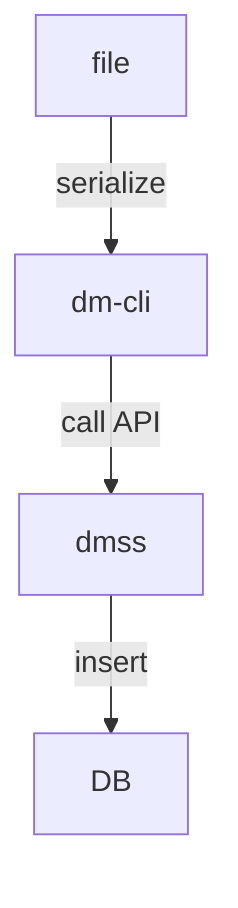
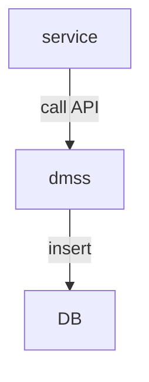
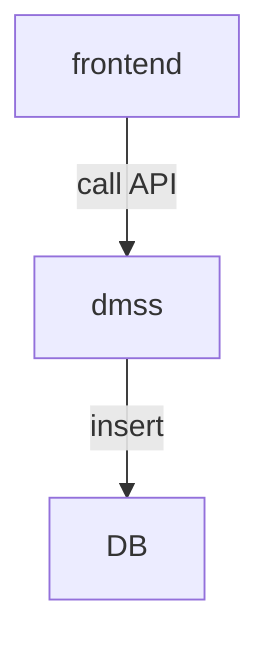
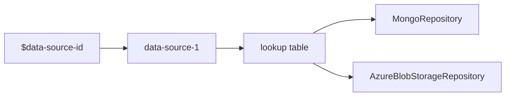

# ADR-0001 - Add support for binary data

Date: 2023-06-19  
  
## Status  
  _Proposed | Accepted | Deprecated | Under consideration | WIP_
  
WIP
  
## Context  

* We need to be able to upload binary data from frontend, DM CLI or from another service to DMSS API.
* We need to be able to get binary data using the DMSS API.

## Decision 

We will introduce a new attribute type called `binary`.

```json
{
  "type": "MyBlueprint",
  "attributes": [
   {
      "type": "BlueprintAttribute",
      "name": "binaryAttribute",
      "attributeType": "binary"
    }
  ]
}
```

### Model contained and storage non-contained

This is when the attribute is specified as non-contained in a storage recipe, as show below:

```json 
{
  "type": "dmss://system/SIMOS/RecipeLink",
  "_blueprintPath_": "MyBlueprint",
  "storageRecipes": [
    {
      "type": "dmss://system/SIMOS/StorageRecipe",
      "name": "DefaultStorageRecipe",
      "attributes": [
        {
          "name": "binaryAttribute",
          "type": "dmss://system/SIMOS/StorageAttribute",
          "contained": false
        }
      ]
    }
  ]
}
```

#### Different use cases

##### From DM CLI

Any binary files on disk will need to be serialized before uploaded to the DMSS.



Note that DM CLI does not use storage recipe to check if the file is binary, it only checks the filename extension.  The DM CLI will treat any file not ending with `.json` as a binary files. 

On disk the reference will point to a binary file using alias and path. The reference type is set to "Storage", that indicates that the binary data is model contained, but not storage contained.

```json
{
    "binaryAttribute": {
       "type": "Reference",
       "address": "ALIAS:/package/binaryFile.something",
       "referenceType": "Storage"
    }
}
```

The binary file will be uploaded to DMSS using DM CLI, and upon uploading DM CLI will change the address:

```json
{
    "binaryAttribute": {
       "type": "Reference",
       "address": "dmss://data-source-1/$1234",
       "referenceType": "Storage"
    }
}
```

Note that the reference does not depend on the storage medium, i.e. the reference on the file system and the corresponding reference after uploading look exactly the same, except for the transformation of address.

TODO: Is it possible to add the binaryFile.something file to the package content, so that we can access it by an address with path?

The binary files are uploaded before documents, using the `/blobs` endpoint, and at the same time we will create a blob lookup table that we will use when we upload the documents.

```
{
   "package/binaryFile.something": "1234"
}
```

When we upload documents, we need to go through the document, and for any reference found that points to a binary file (not `.json`), we will find the blob id by doing a lookup in the blob lookup table and use that inside the address.

##### From another service



Then the binary data needs to be uploaded first, and a reference needs to inserted into the document that should point to the binary data, similar to what the DM CLI does.

```json
{
    "binaryAttribute": {
       "type": "Reference",
       "address": "dmss://data-source-1/$1234",
       "referenceType": "Storage"
  }
}
```

##### From frontend



Then the binary data needs to be uploaded first, and a reference needs to inserted into the document that should point to the binary data, similar to what the DM CLI does.

```json
{
    "binaryAttribute": {
       "type": "Reference",
       "address": "dmss://data-source-1/$1234",
       "referenceType": "Storage"
    }
}
```


#### Data Source ID

The uploaded binary files will get its own data source ID, and this ID will be used inside the address that points to the binary files. 

The job of the data source is to determine which storage medium (repository) is used to store the data. The `$1234` is the data source ID for the given binary file inside the data source `data-source-1`. The data source ID points to an entry in the lookup table for the given data source.

```json
{
	"_id": "data-source-1",
	"repositories": {
		"repository_a": {
			"type": "mongo-db",
            "data-types": "blob"
		}
	},
	"documentLookUp": {
		"1234": {
			"lookup_id": "1234",
			"repository": "repository_a",
			"database_id": "4568",
			"acl": {},
            "data-type": "blob"
		}
	}
}
```

The lookup entry has the information about where the content is stored. Inside each look up entry, there is the `repository` field, that points to one of the repositories defined in the same data source. Each repository entry contains information about how to connect to the storage medium. 



To be able to decide that a data source ID is pointing to a binary data, we want to add a field `storage_affinity` to the lookup entry, that contain what type of data type is the lookup entry for, if it's a binary or not. This is because the repository implementation has different methods for getting and saving binary data (called update_blob, delete_blob, get_blob now). Each repository has the field data_types, and that specify if the repository support other data types like blob. To add meta information, we add a field `meta`, so that we kan keep extra information like filename.

```json
{
  "documentLookUp": {
     "1234": {
        "lookup_id": "1234",
        "repository": "repository-1",
        "database_id": "5678",
        "acl": {},
        "storage_affinity": "blob",
        "meta": {
            "filename": "binaryFile.something"
        }
     }
  }
}
```


### Model contained and storage contained

This is when the model contains the binary data along with other type of attributes.

```json
{
  "type": "Blueprint",
  "attributes": [
    {
	  "type": "BlueprintAttribute",
	  "name": "data",
	  "attributeType": "binary"
	}
  ]
}
```

On disk the data will contain binary content.

```json
{
	"type": "Blueprint",
	"data": b"verylongbinarystring"
}
```

After uploading the data will also contain the binary content.

```json
{
	"type": "Blueprint",
	"data": b"verylongbinarystring"
}
```

TODO: The binary data has to be stored inside the storage medium after upload, and for MongoDB there are several ways of [storing binary inside a document](https://sparkbyexamples.com/mongodb/store-images-in-the-mongodb-database/).


### Endpoints

Given a blueprint, that contains a `data` attribute that is binary.

```json
{
  "type": "Blueprint",
  "attributes": [
    {
	  "type": "BlueprintAttribute",
	  "name": "data",
	  "attributeType": "binary"
	}
  ]
}
```

There exist a custom `/blob/` endpoint to handle:

* GET - Will return the actual blob data.
* Upload - Will upload blob data by given ID.

The `/documents/` endpoint also handle binary data, and what it returns depends on storage.

For storage non-contained. Here the `data` attribute is storage non-contained.
* GET - Since the `data` is non-contained, a reference will be returned.
* POST - Add document, together with files.
* PUT - Change document, together with files.

For model contained. Here the `data` attribute is model contained.
* GET - Since the binary data is contained, the actual data will be returned inline.
* POST - Add document, together with files.
* PUT - Change document, together with files.

Files are sent as form data to the API endpoints, and as per [FastAPI documentation](https://fastapi.tiangolo.com/tutorial/request-files/#request-files), you need to install python-multipart. Data from forms is normally encoded using the "media type" application/x-www-form-urlencoded when it doesn't include files. But when the form includes files, it is encoded as multipart/form-data. This allows forms to be submitted with files.

## Upload model contained and storage non-contained

```python
document = {
    "type": "MyBlueprint",
    "data": {
       "type": "Reference",
       "address": "dmss://data-source-1/$1234",
       "referenceType": "Storage"
    }
}
files = [('data', open('binaryFile.something', 'rb'))]
dmss_api.post(
    "dmss://data-source-1/root-package", data=document, files=files
)
```

TODO: Is this correct?

## Upload model contained and storage contained

```python
document = {
    "type": "MyBlueprint",
    "data": b"verylongbinarystring"
}
dmss_api.post(
    "dmss://data-source-1/root-package", data=document
)
```

TODO: Is this correct?s

## Other considered options  

Create a wrapper upon import when using the DM CLI:

```json
{
  "_id": "1234",
  "type": "File",
  "name": "file.pdf",
  "author" "someone",
  "date": "01/01/20",
  "size": "1G",
  "filetype": "pdf",
  "data": {
    "type": "Reference",
    "address": "DS/$ID",
    "referenceType": "Storage"
  },
  "data": {
    "type": "AzureBlob",
    "address": "$ID"
  },
  "data": {
    "type": "DTO",
    "data": b"binarystuff"
  }
}
```

## Consequences