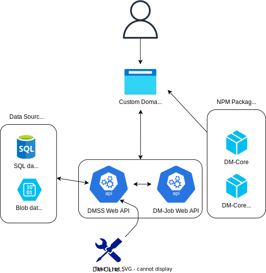

The Development Framework is a framework for standardizing and simplifying processes of building applications by automating mechanisms for data and process modeling, data storage, front-end development and analysis orchestration. 

## Overview

The framework consists of several services, tools, and libraries to be used in the development of applications.

<!--  -->

### Services

* [Data modeling storage service (DMSS)] is a service used for storing, querying, validating, and exporting blueprints and entities.
* [Data modeling job API] is a service for scheduling and running jobs defined as entities in DMSS.

### Tools

- [Data modeling CLI] is a command-line interface (CLI) that can be used to
  - Import and export blueprints and entities to the data modeling storage service
  - Validate entities
  - Delete blueprint and entites
  - Create application contexts
- [Create data modeling app] is used to create new data modelling apps from a template

### Packages

* [Data modeling core packages] contains published [libraries](/docs/category/libraries) like the core frontend package and UI plugins.

## Learn core concepts

First of all you should understand the concept of [blueprints and entitites](./concepts/blueprints). Thats how we define models and create data objects.

Read about [recipes](./concepts/recipes) which is used to extend the application and configure storage of data. 

To understand where data is stored, have a look at [data sources](./concepts/data-sources).

Read about how to extend the application using [plugins](./concepts/plugins). 

[Data modeling job API]: https://github.com/equinor/dm-job
[data modeling CLI]: https://github.com/equinor/dm-cli
[data modeling core packages]: https://github.com/equinor/dm-core-packages 
[create data modeling app]: https://github.com/equinor/create-dm-app
[data modeling tool]: https://github.com/equinor/dm-app-dmt
[data modeling storage service (DMSS)]: https://github.com/equinor/data-modelling-storage-service
